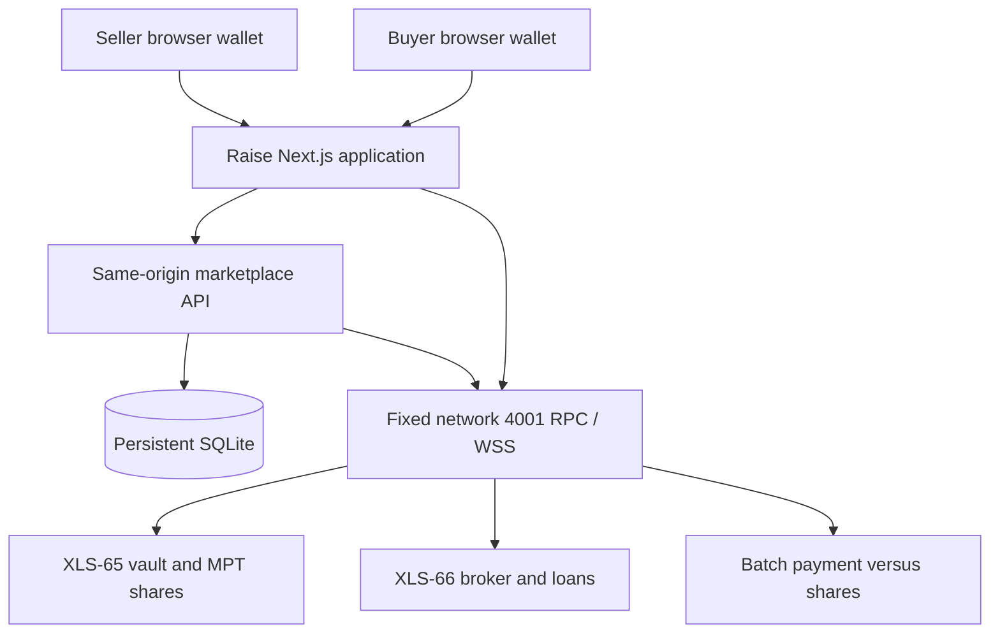

# Raise — a secondary market for XRPL vault shares

Team product document · Version 2 · September 12, 2026

This document describes the implemented V1 and the remaining product hypotheses. [PRODUCT_SCOPE.md](PRODUCT_SCOPE.md) records the accepted scope; [README.md](../README.md) is the starting point for running the application; [the board](https://github.com/users/MylittleQueercat/projects/1) tracks work. Teammates can propose changes without treating every idea here as a delivery commitment.

## The product

Raise lets an investor sell existing vault shares to another investor when the vault cannot supply enough cash for a withdrawal. The buyer pays the seller and acquires the shares. Borrower loans continue on their existing terms.

The selected use case is an open-ended vault financing SME working capital and receivables. Businesses need cash before invoices are paid; investors supply capital and accept credit and liquidity risk. This is the demonstration scenario, not a claim that a real SME portfolio or commercial partner has been onboarded.

In an open-ended vault, a loan's duration is not a personal lockup imposed on each depositor. The practical exit constraint demonstrated by Raise is **available vault cash**. The product trades shares in a pooled position; it does not assign individual Loan objects or lend new money against a seller's position.

## Why each participant uses it

| Participant | Need | What Raise provides |
|---|---|---|
| Investor / seller | Recover liquidity while vault capital is deployed in loans. | Publish a full-lot share offer at an acceptable price. |
| Buyer | Acquire an existing exposure at terms they accept. | Review the position, price and restrictions, then exchange XRP for shares. |
| Operator / loan broker | Run the lending pool and service loans. | Vault, broker, cover, origination and repayment controls for the demo. |
| Borrower | Bridge a working-capital gap. | The underlying lending flow; secondary share sales do not alter the loan. |

A buyer might prefer discounted shares or an existing portfolio to a new deposit. A seller may accept a discount in exchange for earlier liquidity. These are hypotheses about demand. The team-controlled transactions establish technical execution, not willingness to pay or market depth.

## An illustrative trade

These numbers are fictional and do not imply a fixed XRP/share conversion:

1. Alice holds a position with 1,000 XRP of accounting value, while only 50 XRP is available for withdrawal.
2. She offers the selected share lot for 950 XRP.
3. Bob accepts the price after reviewing exposure, liquidity and permissions.
4. An atomic exchange gives Alice 950 XRP and Bob the exact share quantity.
5. Loans continue repaying the vault. Bob can later redeem when rules and available cash permit.

The price is 5% below the displayed accounting value. That discount is not guaranteed profit or an annualized yield: losses, fees, changing value and waiting time affect the buyer's outcome. No buyer means no secondary exit.

## The implemented journey

```mermaid
flowchart LR
  O[Operator creates vault and broker] --> D[Investor deposits XRP]
  D --> L[Borrower receives loan]
  L --> W[Withdrawal exceeds available cash]
  W --> S[Seller lists a share lot]
  S --> B[Buyer approves exact terms]
  B --> A[Seller approves and submits Batch]
  A --> T[XRP and shares exchange atomically]
  T --> R[Borrower repays]
  R --> X[Buyer redeems available vault assets]
```

The trading workflow has two independent browser wallets. The operator and borrower are additional roles used to establish and repay the lending fixture. The operator LoanSet form still uses a labelled local borrower test-seed co-signing mode; the marketplace never asks the buyer to share a seed with the seller.

| Screen | Current behavior |
|---|---|
| Position | Select a vault, inspect ownership/value/cash, deposit, withdraw and start a sale. |
| Market and offer details | Read shared listings, exact quantity and price, valuation context, expiry and settlement state. |
| Sell | Review and publish a fixed-price full-lot ask; cancel while its lifecycle permits. |
| Purchase | Receive-share authorization, buyer approval, seller approval, exact-hash recovery and result. |
| Operator | Create/select vaults, seed liquidity, configure brokers/cover, originate and repay demo loans. |
| Embed | Explore a separate-origin launch/handoff contract; not a production wallet integration SDK. |

The interface uses Apple/system typography, light/dark themes, CSS motion and reduced-motion handling. Its values come from the application and selected ledger, rather than a static illustration.

## Architecture and responsibilities

**Ledger:** ownership, vault accounting, loans, repayments and settled economic transfers.

**Server:** authenticated single-use action intents, shared offers, reservation, recorded signed transaction, one broadcast and exact outcome reconciliation. A stored listing is not ledger ownership and cannot guarantee that a position remains executable.

**Browser:** test-wallet keys and participant approvals. Seeds remain in memory/sessionStorage for the individual demo session; the marketplace accepts public information and signatures. A public transaction journal survives reloads without storing seeds in localStorage.

**Hosting:** one Node/SQLite service on Sunny, managed by Dokploy, with a persistent volume and Cloudflare HTTPS. Current release and acceptance evidence are in [DEPLOYMENT.md](DEPLOYMENT.md). Independent replicas are unsupported by this design.

## Protocol selection

| Layer | Selected capability and proof |
|---|---|
| Track | **Track 1**, open-ended vault on the dedicated network 4001. |
| Vanilla baseline | XLS-65 vault/deposit/withdrawal plus XLS-66 broker/cover/loan/repayment; independently runnable with `npm run vanilla`. |
| Loaded extension | **Batch (XLS-56)** for atomic XRP payment against vault-share delivery. Native vault MPT shares are not counted as an extra primitive. |
| SDK | `xrpl@5.2.0-beta.1` for root and web; historical standalone proofs retain their original pins. |
| Measured accounting | The recorded event ledger enables V1.1. Open-ended loan origination works and interest is recognized when paid. |

Track describes the network/vault model; Loaded describes the additional useful primitive. Using Batch does not switch the project to Track 2. The documented mapping follows the event definition; private mentor confirmation is not recorded.

The [integration evidence](INTEGRATION.md) links the complete API/ledger and two-browser flows, including the buyer's final redemption. [SETTLEMENT.md](SETTLEMENT.md) records the selected mechanism and historical feasibility evidence. The outer Batch result alone is never a completed-sale proof: the service validates exact inner hashes, the parent Batch, ledger and delivered amounts.

## Product and execution boundaries

- **Accounting value, cash and price differ.** Share valuation uses net vault accounting and precise raw units. Cash limits immediate withdrawal. Buyer and seller choose a price independently.
- **One full lot per offer.** The chosen quantity need not be the seller's entire holding, but the live offer is purchased as a whole. Partial fills remain exploration code.
- **No guaranteed exit or return.** Transferability, buyer eligibility, sufficient balances and credit/liquidity risk still matter.
- **Cancellation has limits.** A listing can expire or be cancelled before the supported lifecycle boundary. This does not revoke a previously signed Batch; prepared transactions carry a ledger expiry bound.
- **Ambiguity is preserved.** A timeout or missing proof stays pending. The app checks the recorded transaction instead of sending another payment. Failed signed attempts require investigation.
- **Test environment only.** Master-key faucet wallets and a single host are the current supported configuration. An external production wallet connector, custody architecture and general recovery console are not delivered.

Hosted deployment acceptance is complete in [#45](https://github.com/MylittleQueercat/XRPL_Lending_Protocol_Hackathon_Project/issues/45); see the dated [deployment evidence](DEPLOYMENT.md).

## What remains

| Work | State / decision |
|---|---|
| Mentor demo and presentation | [#27](https://github.com/MylittleQueercat/XRPL_Lending_Protocol_Hackathon_Project/issues/27); prepare the narrative and rehearsal using reproducible evidence. |
| Submission and team sign-off | [#28](https://github.com/MylittleQueercat/XRPL_Lending_Protocol_Hackathon_Project/issues/28). |
| Multiple-vault comparison, bids and RFQs | [#31](https://github.com/MylittleQueercat/XRPL_Lending_Protocol_Hackathon_Project/issues/31); technical comparison exists, independent buyer/seller feedback is missing. |
| Embedding and notifications | [#32](https://github.com/MylittleQueercat/XRPL_Lending_Protocol_Hackathon_Project/issues/32); prototype exists, external integrator validation is missing. |

Future ideas include partial fills, standing bids, negotiated quotes and a partner SDK. They become commitments only after a team decision supported by user need and evidence. See [DISCOVERY.md](DISCOVERY.md), [PARTIAL_FILLS.md](PARTIAL_FILLS.md) and [EMBED.md](EMBED.md).

## Demonstration and developer feedback

The presentation should show **deposit → loan → unavailable withdrawal → offer → two-party share sale → repayment → buyer redemption**. Clearly identify any previously recorded operation rather than presenting historical evidence as a live transaction. Loan timing and interest must use real ledger behavior.

The event guidance recorded by the team weights developer feedback 40%, XRPL execution 30%, creativity/use case 20%, and presentation 10%. The manual report is at [DEVEX_FEEDBACK.md](../DEVEX_FEEDBACK.md); the [findings pool](../devfeedback/README.md) preserves detailed reproductions. Each contributor's consent-based automatic hook is separate from the team report. Slides, the submission form and final sign-off remain tracked deliverables; a code deployment does not complete them.

## Adding a team proposal

Describe the user need, proposed behavior, affected journey, protocol dependency, observable acceptance criteria and decision (proposed, accepted, deferred or rejected). Link a repository issue and coordinate ownership on the shared board. Do not assign teammates implicitly or invent a development schedule.

## Sources

[Hackathon Notion](https://app.notion.com/p/adam-hn/XRPL-Lending-Protocol-Hackathon-5cc7508f4cdc83a7991e01f90528e490) · [XLS-65](https://github.com/XRPLF/XRPL-Standards/tree/master/XLS-0065-single-asset-vault) · [XLS-66](https://github.com/XRPLF/XRPL-Standards/tree/master/XLS-0066-lending-protocol) · [Batch](https://xrpl.org/docs/references/protocol/transactions/types/batch) · [V1.1 reference](https://opensource.ripple.com/docs/lending-protocol-v1-1)

**Pitch:** Raise gives investors a way to sell XRPL vault shares when the vault cannot fund their withdrawal, while the underlying loans continue.
